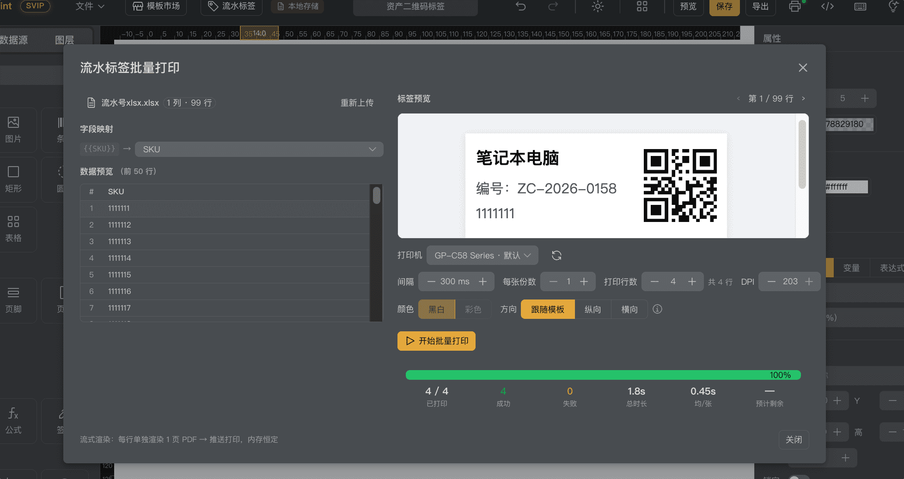
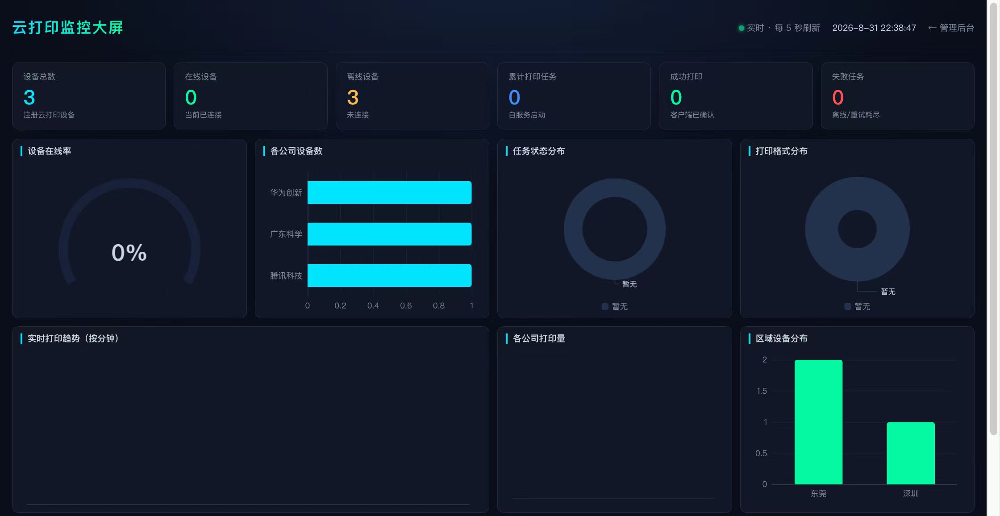

<p align="center">
  
</p>

<h1 align="center">OpenPrint</h1>

<p align="center">
  <strong>开源 Web 打印设计器 · AI 驱动 · 框架无关 · 跨平台</strong>
</p>
<p align="center">
  <a href="https://github.com/your-repo/open-print/stargazers"></a>
  <a href="https://github.com/your-repo/open-print/releases"></a>
  <a href="LICENSE"></a>
  <a href="https://vuejs.org/"></a>
  <a href="https://www.naiveui.com/"></a>
  <a href="https://www.typescriptlang.org/"></a>
  <a href="https://github.com/fabricjs/fabric.js"></a>
  <a href="https://www.npmjs.com/package/openprint26"></a>
</p>


<p align="center">
  <a href="#features">功能特性</a> ·
  <a href="#quick-start">快速开始</a> ·
  <a href="#ai-assistant">AI 助手</a> ·
  <a href="#architecture">架构</a> ·
  <a href="#deploy">部署</a> ·
  <a href="#faq">FAQ</a>
</p>
<br />

🚀 **诚邀开发者加入** — 我们欢迎全球开发者加入 OpenPrint 开源社区，共同参与产品研发，贡献代码、提交 Issue 或建议，一起打造更优秀的打印解决方案！

**OpenPrint** 是一款开源、零后端依赖的 Web 打印模板可视化设计器。它让用户通过拖拽即可设计快递面单、发票、标签、报表等打印模板，支持 AI 一句话生成、云打印、C++ 桌面客户端静默打印，3 分钟即可对接 ERP 系统。

> 纯前端架构，无需服务器，无需数据库，一个浏览器即可运行。

> **框架无关设计** — 核心渲染引擎与 UI 层完全解耦，设计器基于 Vue 3 + Naive UI 构建，渲染引擎使用纯 TypeScript 实现，可无缝接入 React、Vue、Angular、原生 JS 等任意技术栈。


*所见即所得的打印模板设计器，拖拽控件、实时预览*

### 一键导入 · 百张秒打

把 Excel 流水数据直接导入设计器，自动映射字段、自动生成流水号，批量打印差异化的货物标签、资产标签、流水线标签。

- ✓**Excel 数据直联** — 上传表格自动识别列，字段一键映射到标签
- ✓**流水号自动编排** — 支持"分类-年份-序号"自定义规则，如 ZC-2026-0158
- ✓**一行一标签** — 每行数据生成一张独立标签，99 行批量输出 99 张
- ✓**逐条预览校验** — 第 1/99 行分页预览，批量前逐条检查，避免打错
- ✓**打印实时监控** — 进度条 + 成功/失败统计 + 耗时均速，全程可视可控
- ✓**多标签场景** — 货物 SKU 标、资产标识、流水线 SN 码、仓储码，一屏搞定



---

## 目录

- [核心亮点](#核心亮点)
- [功能特性](#功能特性)
- [快速开始](#快速开始)
- [AI 助手](#ai-助手)
- [技术架构](#技术架构)
- [项目结构](#项目结构)
- [部署](#部署)
- [桌面客户端](#桌面客户端)
- [ERP 对接](#erp-对接)
- [FAQ](#faq)
- [贡献指南](#贡献指南)
- [许可证](#许可证)

---

## 核心亮点

### 🔌 框架无关，引擎与 UI 解耦

OpenPrint 采用**引擎层与 UI 层分离**的架构设计：

- **渲染引擎**（`@openprint/engine`）— 纯 TypeScript 实现，零框架依赖，负责模板解析、数据绑定、分页排版、HTML/PDF/SVG 渲染导出
- **设计器 UI**（`openprint26`）— 基于 Vue 3 + Naive UI 构建可视化拖拽设计器

无论你的项目用 **React、Vue、Angular** 还是 **原生 JS**，都能轻松集成：

| 接入方式 | 说明 |
|----------|------|
| **Vue 3 项目** | 直接安装 `openprint26`，使用 `<OpenPrintDesigner />` 组件 |
| **React 项目** | 通过引擎 SDK 渲染模板，或用 Web Components 包装设计器 |
| **Angular 项目** | 引擎 SDK 渲染 + iframe 嵌入设计器 |
| **原生 JS / 任何框架** | 引擎 SDK 零依赖，`render({ template, data })` 即可输出 HTML |

### 🤖 AI 一句话生成模板

告别手动拖拽，直接描述需求即可生成专业打印模板。支持快递面单、物流标签、仓储单据、零售小票等多种场景。


*AI 自然语言生成打印模板，一句话完成面单设计*

```
用户输入："帮我生成一张快递面单，含收件人、寄件人和运单号条码"
AI 输出： 自动创建模板 → 布局文本控件 → 添加条码 → 一键使用
```

### ☁️ 云打印

跨地域多门店远程打印，模板统一管理。浏览器直接打印，免装驱动。云端打印队列，断线自动重试，权限管控，打印日志审计。


*多门店远程打印，模板统一管理，打印队列监控*



云控大屏

### 📊 Web 报表设计

分组表、交叉表、主从表等多级报表结构，支持求和/平均/计数等汇总函数，嵌入柱状图/折线图/饼图，条件格式高亮数据预警，多数据源拼接。


*分组报表、交叉表、图表，满足复杂数据展示需求*

---

## 功能特性

### 设计器

| 功能 | 说明 |
|------|------|
| **控件库** | 文本、图片、矩形、圆形、线条、条码、二维码、表格、富文本、图表 10 种控件 |
| **拖拽设计** | 所见即所得，自由拖拽 + 吸附对齐 + 标尺辅助 |
| **多页支持** | 多页设计，每页独立页眉页脚，页间距可调 |
| **数据绑定** | 支持 JSON / CSV / API 数据源，Mustache 表达式绑定 |
| **主题切换** | 基于 Naive UI 的深色/浅色主题，一键切换 |
| **框架无关** | 引擎层纯 TypeScript，支持 React/Vue/Angular/原生 JS |
| **模板管理** | 本地存储，模板导入/导出，模板市场 |
| **实时预览** | 预览数据绑定效果，分页预览 |
| **导出** | PDF / JPG / SVG / HTML 多格式导出 |

### 打印与对接

- **Web 直接打印** — 浏览器调用系统打印对话框
- **桌面静默打印** — 配套 C++ Qt 客户端，零弹窗打印
- **云打印** — 远程门店打印，打印队列管理
- **ERP 对接** — HTTP API 对接，3 分钟接入

### 技术栈

#### 设计器 UI 层


#### 核心引擎层（框架无关）


> 引擎层零框架依赖，设计器 UI 基于 Vue 3 + Naive UI。React / Angular / 原生 JS 项目均可通过引擎 SDK 集成。

---

## 快速开始

### npm 安装（推荐）

```bash
# npm
npm i openprint26

# pnpm
pnpm add openprint26

# yarn
yarn add openprint26
```

### Vue 3 项目使用

```ts
import { createApp } from 'vue'
import OpenPrint from 'openprint26'
import 'openprint26/dist/style.css'

const app = createApp(App)
app.use(OpenPrint)
app.mount('#app')
```

```vue
<template>
  <OpenPrintDesigner />
</template>
```

### React 项目使用

渲染引擎通过 SDK 直接调用，零框架依赖：

```tsx
import { useEffect, useRef } from 'react'
import { render } from 'openprint26'

export default function App() {
  const containerRef = useRef<HTMLDivElement>(null)

  useEffect(() => {
    render({ template: templateJson, data }).then(({ html, pages, warnings }) => {
      containerRef.current!.innerHTML = html
      console.log('共', pages, '页；告警：', warnings)
    })
  }, [])

  return <div ref={containerRef} />
}
```

### 原生 JS / 任意框架使用

```ts
import { render, createHeadless } from 'openprint26'

// 1. 渲染模板为 HTML（异步：二维码等资源在渲染期解析）
const { html, pages, warnings } = await render({
  template: templateJson,
  data: {
    sender_name: '张三',
    receiver_name: '李四',
    tracking_no: 'SF1234567890',
  },
})
document.getElementById('print-area').innerHTML = html

// 2. 导出 PDF / JPG / SVG
const headless = createHeadless()
const { blobs, filenames } = await headless.exportPdf({ template: templateJson, data })
blobs.forEach((b, i) => downloadBlob(b, filenames[i]))
headless.dispose()
```

### Node 服务端使用

```ts
// 仅渲染 HTML，不依赖 DOM；PDF 请交给 puppeteer / wkhtmltopdf
import { render } from 'openprint26/node'

const { html } = await render({ template: templateJson, data })
```

> 体积：核心约 176 kB（gzip ~53 kB）。条码、二维码、公式（KaTeX）与 jspdf 均为
> **按需加载** —— 模板里没有对应控件就不会下载。

### 从源码运行

```bash
# 克隆仓库
git clone https://gitee.com/haiming236/openprint.git
cd open-print

# 安装依赖
pnpm install

# 启动开发服务器
pnpm dev

# 构建生产版本
pnpm build

# 预览生产构建
pnpm preview
```

### 环境要求

- Node.js >= 22.18.0
- pnpm >= 9.x

### 在线演示

访问 [https://openprint.yy360.space](https://openprint.yy360.space) 在线体验设计器。

---

## AI 助手

OpenPrint 内置 AI 助手，支持自然语言生成打印模板。

### 使用方式

1. **新建模板** — 输入需求描述，AI 自动生成完整模板
2. **修改当前模板** — 选中控件，让 AI 调整布局或样式
3. **字段接地** — 自动识别数据字段并绑定到模板控件

### 技术原理

- 基于 LLM 解析用户意图，输出结构化模板描述
- 内部规范引擎将描述转换为 Fabric.js 控件配置
- 支持上下文感知，可在已有模板上增量修改

### 支持的场景

- 快递面单（顺丰、京东、邮政等格式）
- 物流标签（运单号、目的地、重量）
- 仓储单据（入库单、出库单、盘点单）
- 零售小票（收银小票、退换货单）
- 发票（增值税发票、收据）
- 自定义报表

---

## 技术架构

OpenPrint 采用 **引擎层与 UI 层分离** 的架构，核心引擎零框架依赖，可被任意前端框架调用：

```
┌─────────────────────────────────────────────────────────────────────┐
│                        UI 层（可替换）                               │
│                                                                     │
│   ┌─────────────────┐  ┌──────────────┐  ┌───────────────────────┐ │
│   │ Vue 3 + Naive UI │  │   React      │  │ 原生 JS / Angular     │ │
│   │ 设计器（官方）   │  │  自定义 UI   │  │ iframe / Web Component│ │
│   └────────┬────────┘  └──────┬───────┘  └──────────┬────────────┘ │
│            └───────────────────┴─────────────────────┘              │
│                                │ SDK API                            │
╞════════════════════════════════╪═══════════════════════════════════╡
│                        引擎层（框架无关）                           │
│                                ▼                                    │
│  ┌───────────────────────────────────────────────────────────────┐ │
│  │              排版引擎 (Layout Engine) — 纯 TypeScript         │ │
│  │   数据绑定 │ 表达式计算 │ 分页引擎 │ 表格引擎 │ 分组引擎     │ │
│  └───────────────────────────┬───────────────────────────────────┘ │
│                              ▼                                     │
│  ┌───────────────────────────────────────────────────────────────┐ │
│  │              渲染引擎 (Renderer) — 纯 TypeScript              │ │
│  │   HTML 渲染 │ PDF 导出 │ JPG 导出 │ SVG 导出 │ 富文本渲染    │ │
│  └───────────────────────────────────────────────────────────────┘ │
└─────────────────────────────────────────────────────────────────────┘
                               │
                      ┌────────┴────────┐
                      ▼                 ▼
             ┌──────────────┐  ┌──────────────┐
             │ C++ Qt 客户端 │  │ 云打印服务    │
             │ 静默打印      │  │ 远程打印      │
             └──────────────┘  └──────────────┘
```

### 分层说明

| 层级 | 技术 | 说明 |
|------|------|------|
| **设计器 UI** | Vue 3 + Naive UI + Fabric.js | 官方可视化设计器，提供拖拽、属性面板、图层管理等交互 |
| **排版引擎** | 纯 TypeScript | 模板解析、数据绑定、分页、表格、分组、表达式计算 |
| **渲染引擎** | 纯 TypeScript | HTML/PDF/JPG/SVG 多格式渲染导出，零框架依赖 |
| **AI 助手** | TypeScript | LLM 意图解析、模板生成、上下文管理 |
| **桌面客户端** | C++ + Qt | 静默打印、批量打印、打印机管理 |

### 核心模块

| 模块 | 路径 | 说明 |
|------|------|------|
| **排版引擎** | `src/core/layout-engine/` | 数据绑定、分页、表格、分组、表达式（框架无关） |
| **渲染引擎** | `src/core/renderer-html/` | HTML 渲染、CSS 生成、富文本渲染（框架无关） |
| **导出引擎** | `src/core/export-engine/` | PDF、JPG、SVG 导出（框架无关） |
| **SDK** | `src/core/sdk/` | 引擎对外 API 封装，供任意框架调用 |
| **设计器** | `src/design/` | Vue 3 + Naive UI 设计器界面 |
| **AI 助手** | `src/ai/` | AI 生成模板、上下文管理 |
| **控件库** | `src/design/canvas/controls/` | 10 种 Fabric.js 控件 |

---

## 项目结构

```
open-print/
├── src/
│   ├── ai/                        # AI 助手（生成/规范化/客户端）
│   ├── core/                      # 核心引擎
│   │   ├── layout-engine/         # 排版引擎（数据绑定/分页/表格/分组）
│   │   ├── renderer-html/         # HTML 渲染器
│   │   ├── export-engine/         # 导出引擎（PDF/JPG/SVG）
│   │   ├── chartkit/              # 图表渲染（柱状图/折线图/饼图）
│   │   ├── fonts/                 # 字体加载与管理
│   │   ├── headless/              # 无头渲染
│   │   ├── spec/                  # 模板规范与校验
│   │   └── sdk/                   # SDK 封装
│   ├── design/                    # 设计器界面
│   │   ├── canvas/                # Canvas 画布 & 控件
│   │   ├── panels/                # 属性/图层/数据源面板
│   │   ├── preview/               # 预览面板
│   │   ├── toolbar/               # 顶部工具栏
│   │   ├── modals/                # 模态框（导入/导出/设置）
│   │   └── stores/                # Pinia 状态管理
│   ├── repository/                # 数据仓库（本地/HTTP/模拟）
│   ├── types/                     # TypeScript 类型定义
│   ├── config/                    # 配置（打印设置/AI 设置）
│   ├── theme/                     # 主题系统
│   └── utils/                     # 工具函数
├── website/                       # 宣传官网
├── dist/                          # 构建输出
├── public/                        # 静态资源
└── docs/                          # 文档
```

---

## 部署

### 静态部署

构建产物为纯静态文件，可部署到任何 HTTP 服务器：

```bash
pnpm build
# 将 dist/ 目录部署到 Nginx / Apache / Vercel / Netlify 等
```

### Nginx 配置示例

```nginx
server {
    listen 80;
    server_name your-domain.com;
    root /path/to/open-print/dist;
    index index.html;

    location / {
        try_files $uri $uri/ /index.html;
    }
}
```

### Docker 部署

```dockerfile
FROM nginx:alpine
COPY dist/ /usr/share/nginx/html
COPY nginx.conf /etc/nginx/conf.d/default.conf
EXPOSE 80
```

---

## 桌面客户端

OpenPrint 提供配套的 **C++ Qt 桌面打印客户端**，支持：

- **静默打印** — 接收设计器模板，直接发送到本地打印机，零弹窗
- **批量打印** — 支持 CSV/JSON 数据批量渲染与打印
- **本地打印机管理** — 获取打印机列表、状态监控
- **HTTP 接口** — 通过 REST API 接收打印任务
- **跨平台** — Windows / Linux / macOS


*C++ Qt 桌面客户端，静默打印，批量处理*

### 技术栈


---

## ERP 对接

OpenPrint 提供标准 HTTP API，3 分钟即可完成 ERP 对接：

### 对接流程

1. **设计模板** — 在 Web 设计器中拖拽生成打印模板
2. **导出模板文件** — 导出 `.json` 模板文件
3. **API 对接** — ERP 系统通过 HTTP 推送数据 + 模板 ID，触发打印


*标准 HTTP API 对接，3 分钟接入 ERP 系统*

### API 示例

```http
POST /api/print
Content-Type: application/json

{
  "template_id": "waybill-001",
  "data": {
    "sender_name": "张三",
    "sender_phone": "13800138000",
    "receiver_name": "李四",
    "receiver_address": "北京市朝阳区..."
  },
  "printer": "local-printer-01",
  "copies": 1
}
```

---

## FAQ

### 如何安装 OpenPrint？

```bash
npm i openprint26
```

详细用法见 [快速开始](#快速开始) 章节。

### 支持 React / Angular / 原生 JS 吗？

支持。OpenPrint 的核心渲染引擎使用纯 TypeScript 实现，零框架依赖（已验证产物不含 Vue 运行时）。引擎 SDK 提供 `render()`、`renderDocument()`、`createHeadless()` 等方法，在任何 JS 环境中均可直接调用。

- **浏览器**：`import { render, createHeadless } from 'openprint26'` —— 可渲染并导出 PDF / JPG / SVG
- **Node 服务端**：`import { render } from 'openprint26/node'` —— 仅渲染 HTML（导出需要 DOM）

### 设计器用了什么 UI 组件库？

设计器界面基于 [Naive UI](https://www.naiveui.com/) 构建，搭配 Vue 3 + Fabric.js。Naive UI 提供了完整的深色/浅色主题支持、丰富的组件库和优秀的开发体验。

### OpenPrint 需要后端服务吗？

不需要。OpenPrint 是纯前端应用，零后端依赖。模板存储在浏览器本地（IndexedDB），AI 功能通过直接调用 LLM API 实现。如需对接打印机或 ERP，可部署可选的桌面客户端。

### 支持哪些浏览器？

Chrome / Edge / Firefox / Safari 等现代浏览器。推荐使用 Chromium 内核浏览器以获得最佳体验。

### 如何自定义字体？

将字体文件（`.ttf` / `.woff2`）放入 `public/fonts/` 目录，并在 `src/core/fonts/catalog.ts` 中注册即可。

启动客户端，支持扫描系统全部字体

### 支持批量打印吗？

支持。通过 CSV/JSON 数据源 + 模板引擎，可批量生成多页文档并导出或打印。桌面客户端支持批量静默打印。

### 如何导出模板与他人分享？

使用模板导出功能导出 `.json` 文件，其他人可通过导入功能加载使用。也支持 URL 编码分享（零后端）。

---

## 贡献指南

欢迎贡献代码、提交 Issue 或建议！

### 开发流程

1. Fork 本仓库
2. 创建特性分支 (`git checkout -b feature/amazing-feature`)
3. 提交更改 (`git commit -m 'feat: add amazing feature'`)
4. 推送到分支 (`git push origin feature/amazing-feature`)
5. 提交 Pull Request

### 提交规范

本项目使用 [Conventional Commits](https://www.conventionalcommits.org/) 规范：

- `feat:` 新功能
- `fix:` 修复
- `docs:` 文档变更
- `refactor:` 重构
- `test:` 测试
- `chore:` 构建/工具变更

### 开发命令

```bash
# 运行测试
pnpm vitest

# 类型检查
pnpm type-check

# 格式化代码
pnpm format

# 代码覆盖率
pnpm vitest --coverage
```

---

## 赞助支持

OpenPrint 是一个开源项目，如果你觉得它对你有帮助，欢迎赞助支持项目持续研发和维护，扫码请备注，优先获得最新版本维护。

<table>
  <tr>
    <td align="center">
      
      <br />
      <sub>微信赞助</sub>
    </td>
    <td align="center">
      
      <br />
      <sub>支付宝赞助</sub>
    </td>
  </tr>
</table>
### 赞助者名单

感谢以下赞助者的支持（按赞助时间排序）：

| 名称 | 金额 | 日期 |
|------|------|------|
| _JiaYang_ | 99 | 2026-08-14 |

---

## 许可证

[GPL3.0 License](LICENSE)

Copyright (c) 2025 OpenPrint

---

<p align="center">
  <b>OpenPrint</b> — 让打印变得简单高效
</p>
<p align="center">
  <a href="https://github.com/haiming236/openprint">GitHub</a> ·
  <a href="https://gitee.com/haiming236/openprint">Gitee</a> ·
  <a href="https://openprint.yy360.space">在线演示</a>
</p>
