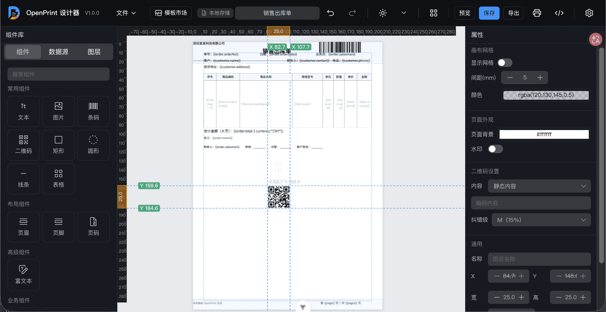
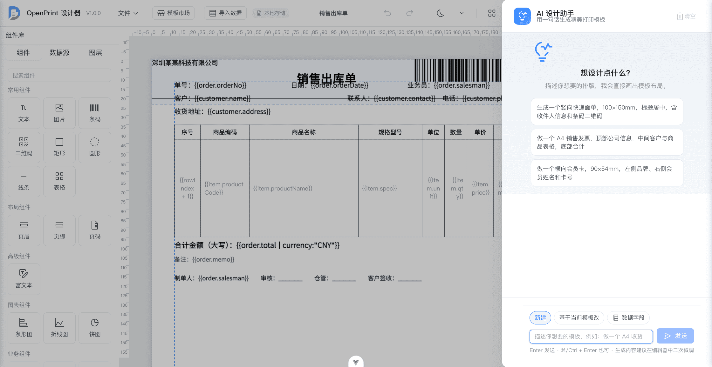
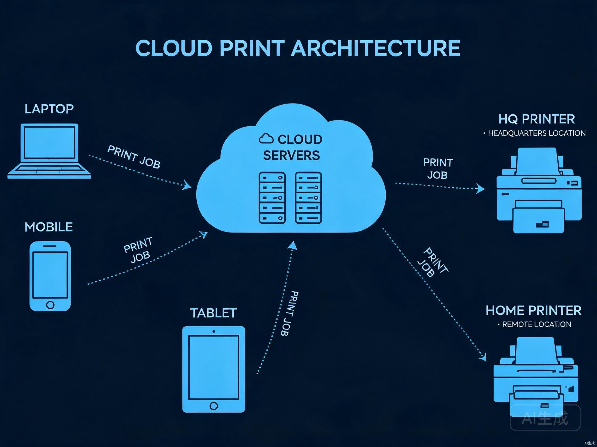
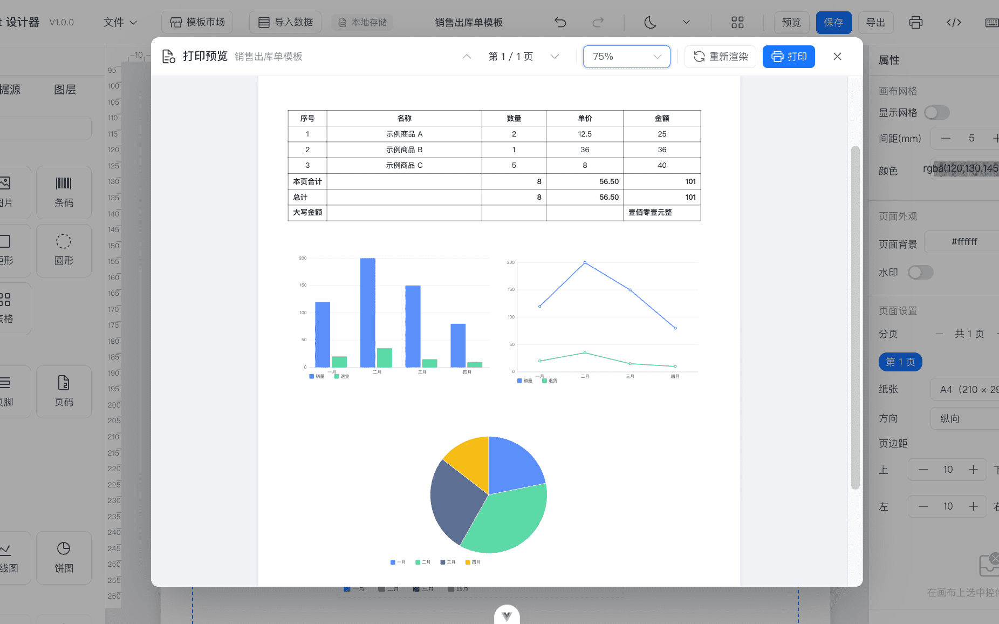
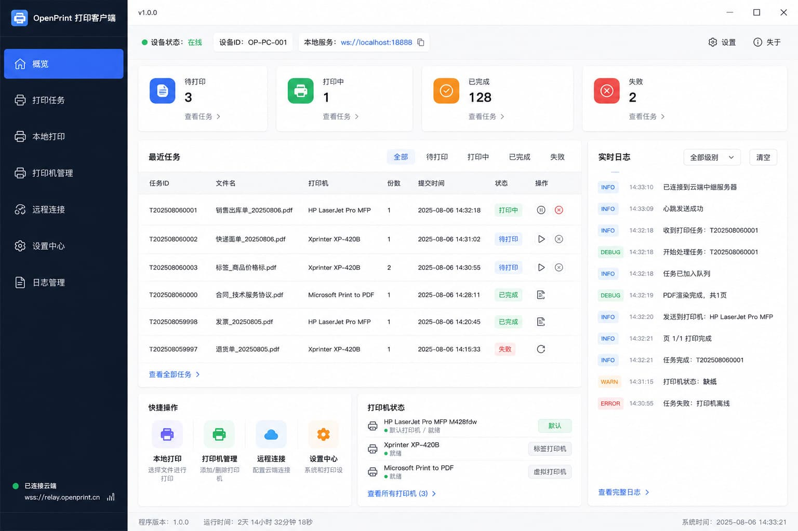
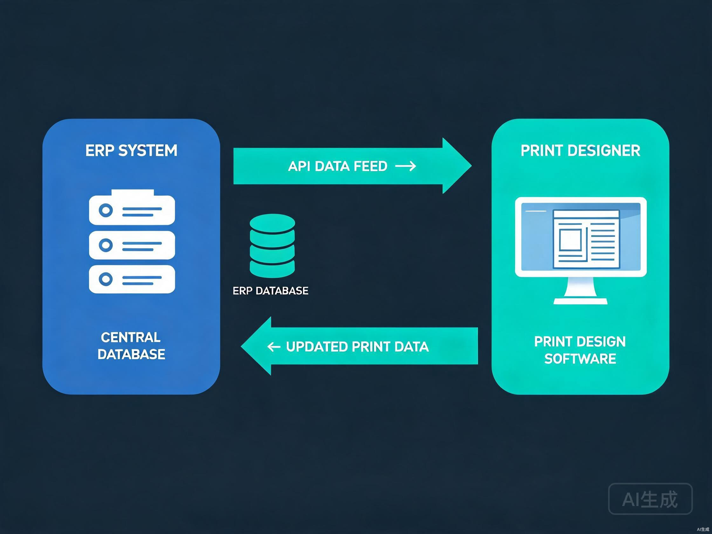

<p align="center">
  
</p>

<h1 align="center">OpenPrint</h1>

<p align="center">
  <strong>オープンソース Web 印刷デザイナー · AI 駆動 · フレームワーク非依存 · クロスプラットフォーム</strong>
</p>

<p align="center">
  <a href="https://github.com/your-repo/open-print/stargazers"></a>
  <a href="https://github.com/your-repo/open-print/releases"></a>
  <a href="LICENSE"></a>
  <a href="https://vuejs.org/"></a>
  <a href="https://www.naiveui.com/"></a>
  <a href="https://www.typescriptlang.org/"></a>
  <a href="https://github.com/fabricjs/fabric.js"></a>
  <a href="https://www.npmjs.com/package/openprint26"></a>
</p>

<p align="center">
  <a href="#特徴">特徴</a> ·
  <a href="#クイックスタート">クイックスタート</a> ·
  <a href="#aiアシスタント">AI アシスタント</a> ·
  <a href="#アーキテクチャ">アーキテクチャ</a> ·
  <a href="#デプロイ">デプロイ</a> ·
  <a href="#faq">FAQ</a>
</p>
<br />

**OpenPrint** は、オープンソース・バックエンド不要の Web 印刷テンプレート・ビジュアルデザイナーです。ドラッグ＆ドロップで宅配便ラベル、請求書、ラベル、帳票などの印刷テンプレートをデザインでき、AI によるワンライナー生成、クラウド印刷、C++ デスクトップクライアントによるサイレント印刷をサポートし、3 分で ERP システムと連携できます。

> 純フロントエンド構成 — サーバー不要、データベース不要、ブラウザだけで動作します。

> **フレームワーク非依存設計** — コアレンダリングエンジンと UI 層が完全に分離されています。デザイナーは Vue 3 + Naive UI で構築され、レンダリングエンジンは純 TypeScript で実装されており、React・Vue・Angular・ネイティブ JS などあらゆる技術スタックにシームレスに組み込めます。


*WYSIWYG 印刷テンプレートデザイナー、ドラッグ＆ドロップとリアルタイムプレビュー*

---

## 目次

- [主な特徴](#主な特徴)
- [機能一覧](#機能一覧)
- [クイックスタート](#クイックスタート)
- [AI アシスタント](#aiアシスタント)
- [技術アーキテクチャ](#技術アーキテクチャ)
- [プロジェクト構成](#プロジェクト構成)
- [デプロイ](#デプロイ)
- [デスクトップクライアント](#デスクトップクライアント)
- [ERP 連携](#erp連携)
- [FAQ](#faq)
- [貢献ガイド](#貢献ガイド)
- [ライセンス](#ライセンス)

---

## 主な特徴

### 🔌 フレームワーク非依存、エンジンと UI の分離

OpenPrint は**エンジン層と UI 層の分離**というアーキテクチャを採用しています：

- **レンダリングエンジン**（`@openprint/engine`）— 純 TypeScript 実装、フレームワーク依存ゼロ。テンプレート解析、データバインディング、ページ分割、HTML/PDF/SVG レンダリング・エクスポートを担当
- **デザイナー UI**（`openprint26`）— Vue 3 + Naive UI によるビジュアル・ドラッグ＆ドロップデザイナー

**React・Vue・Angular・ネイティブ JS** のどのプロジェクトにも簡単に統合できます：

| 統合方法 | 説明 |
|----------|------|
| **Vue 3 プロジェクト** | `openprint26` をインストールし、`<OpenPrintDesigner />` コンポーネントを使用 |
| **React プロジェクト** | エンジン SDK でテンプレートをレンダリング、または Web Components でデザイナーをラップ |
| **Angular プロジェクト** | エンジン SDK レンダリング + iframe 埋め込みデザイナー |
| **ネイティブ JS / 任意フレームワーク** | エンジン SDK 依存ゼロ、`renderTemplate(json, data)` で HTML を出力 |

### 🤖 AI によるワンライナー・テンプレート生成

手動のドラッグ＆ドロップは不要。要件を記述するだけでプロフェッショナルな印刷テンプレートを生成します。宅配便面单（送り状）、物流ラベル、倉庫帳票、小売レシートなど様々なシーンに対応。


*AI 自然言語で印刷テンプレートを生成、一言で面单デザイン完了*

```
ユーザー入力：「宅配便送り状を生成して。受取人・差出人・伝票番号バーコード付きで」
AI 出力： テンプレート自動作成 → テキストコントロール配置 → バーコード追加 → ワンクリックで使用
```

### ☁️ クラウド印刷

複数地域・複数店舗のリモート印刷、テンプレートの一元管理。ブラウザから直接印刷、ドライバ不要。クラウド印刷キュー、切断時自動リトライ、権限制御、印刷ログ監査。


*複数店舗のリモート印刷、テンプレート一元管理、印刷キュー監視*

### 📊 Web 帳票デザイン

グループ表、クロス集計表、マスター/ディテール表などの多段帳票構造をサポート。合計/平均/カウントなどの集計関数、棒グラフ/折れ線グラフ/円グラフの埋め込み、条件付き書式によるデータ警告、複数データソースの結合。


*グループ帳票、クロス集計、チャート、複雑なデータ表示に対応*

---

## 機能一覧

### デザイナー

| 機能 | 説明 |
|------|------|
| **コントロールライブラリ** | テキスト・画像・矩形・円形・線・バーコード・QRコード・テーブル・リッチテキスト・チャートの 10 種 |
| **ドラッグ＆ドロップ** | WYSIWYG、自由ドラッグ + スナップ整列 + ルーラー補助 |
| **複数ページ対応** | 複数ページデザイン、ページごとのヘッダー/フッター、ページ間隔調整 |
| **データバインディング** | JSON / CSV / API データソース、Mustache 式バインディング |
| **テーマ切替** | Naive UI ベースのダーク/ライトテーマ、ワンクリック切替 |
| **フレームワーク非依存** | エンジン層は純 TypeScript、React/Vue/Angular/ネイティブ JS 対応 |
| **テンプレート管理** | ローカル保存、テンプレートインポート/エクスポート、テンプレートマーケット |
| **リアルタイムプレビュー** | データバインディング結果のプレビュー、ページ分割プレビュー |
| **エクスポート** | PDF / JPG / SVG / HTML 複数フォーマット |

### 印刷と連携

- **Web 直接印刷** — ブラウザのシステム印刷ダイアログを呼び出し
- **デスクトップサイレント印刷** — C++ Qt クライアント、ダイアログなし印刷
- **クラウド印刷** — リモート店舗印刷、印刷キューの管理
- **ERP 連携** — HTTP API 連携、3 分で導入

### 技術スタック

#### デザイナー UI 層


#### コアエンジン層（フレームワーク非依存）


> エンジン層はフレームワーク依存ゼロ。デザイナー UI は Vue 3 + Naive UI ベース。React / Angular / ネイティブ JS プロジェクトはエンジン SDK で統合可能。

---

## クイックスタート

### npm インストール（推奨）

```bash
# npm
npm i openprint26

# pnpm
pnpm add openprint26

# yarn
yarn add openprint26
```

### Vue 3 プロジェクトでの使用

```ts
import { createApp } from 'vue'
import OpenPrint from 'openprint26'
import 'openprint26/dist/style.css'

const app = createApp(App)
app.use(OpenPrint)
app.mount('#app')
```

```vue
<template>
  <OpenPrintDesigner />
</template>
```

### React プロジェクトでの使用

デザイナーは iframe で埋め込み、レンダリングエンジンは SDK で直接呼び出します：

```tsx
import { useEffect, useRef } from 'react'
import { renderTemplate, exportPDF } from 'openprint26/sdk'

export default function App() {
  const containerRef = useRef<HTMLDivElement>(null)

  useEffect(() => {
    // エンジンレンダリング — フレームワーク依存ゼロ、HTML を直接出力
    const html = renderTemplate(templateJson, data)
    containerRef.current!.innerHTML = html
  }, [])

  return (
    <>
      {/* デザイナー：iframe 埋め込み */}
      <iframe src="/openprint/designer.html" width="100%" height="600" />
      {/* レンダリング出力 */}
      <div ref={containerRef} />
    </>
  )
}
```

### ネイティブ JS / 任意フレームワークでの使用

```ts
// エンジン SDK — 依存ゼロ、純 TypeScript
import { renderTemplate, exportPDF } from 'openprint26/sdk'

// 1. テンプレートを HTML にレンダリング
const html = renderTemplate(templateJson, {
  sender_name: '山田太郎',
  receiver_name: '佐藤花子',
  tracking_no: 'SF1234567890',
})
document.getElementById('print-area').innerHTML = html

// 2. PDF エクスポート
const pdfBlob = await exportPDF(templateJson, data)

// 3. デザイナーは iframe で埋め込み
// <iframe src="openprint26/designer.html" />
```

### ソースコードから実行

```bash
# リポジトリをクローン
git clone https://gitee.com/haiming236/openprint.git
cd open-print

# 依存関係をインストール
pnpm install

# 開発サーバーを起動
pnpm dev

# 本番ビルド
pnpm build

# 本番ビルドのプレビュー
pnpm preview
```

### 環境要件

- Node.js >= 22.18.0
- pnpm >= 9.x

### オンラインデモ

[https://openprint.yy360.space](https://openprint.yy360.space) にアクセスしてデザイナーを体験できます。

---

## AI アシスタント

OpenPrint には AI アシスタントが組み込まれており、自然言語で印刷テンプレートを生成できます。

### 使い方

1. **新規テンプレート** — 要件を入力すると、AI が完全なテンプレートを自動生成
2. **現在のテンプレートを修正** — コントロールを選択し、AI にレイアウトやスタイルを調整させる
3. **フィールドバインディング** — データフィールドを自動認識してテンプレートコントロールにバインド

### 技術原理

- LLM によるユーザー意図の解析と、構造化されたテンプレート記述の出力
- 内部仕様エンジンが記述を Fabric.js コントロール設定に変換
- コンテキスト認識対応、既存テンプレートへの増分修正が可能

### 対応シーン

- 宅配便送り状（順豊・京東・郵政などのフォーマット）
- 物流ラベル（伝票番号・宛先・重量）
- 倉庫帳票（入庫伝票・出庫伝票・棚卸伝票）
- 小売レシート（レジレシート・返品交換伝票）
- 請求書（増値税請求書・領収書）
- カスタム帳票

---

## 技術アーキテクチャ

OpenPrint は**エンジン層と UI 層の分離**アーキテクチャを採用し、コアエンジンはフレームワーク依存ゼロで、あらゆるフロントエンドフレームワークから呼び出せます：

```
┌─────────────────────────────────────────────────────────────────────┐
│                        UI 層（差し替え可能）                         │
│                                                                     │
│   ┌─────────────────┐  ┌──────────────┐  ┌───────────────────────┐ │
│   │ Vue 3 + Naive UI │  │   React      │  │ ネイティブ JS / Angular│ │
│   │ デザイナー（公式）│  │  カスタムUI  │  │ iframe / Web Component│ │
│   └────────┬────────┘  └──────┬───────┘  └──────────┬────────────┘ │
│            └───────────────────┴─────────────────────┘              │
│                                │ SDK API                            │
╞════════════════════════════════╪═══════════════════════════════════╡
│                        エンジン層（フレームワーク非依存）            │
│                                ▼                                    │
│  ┌───────────────────────────────────────────────────────────────┐ │
│  │          レイアウトエンジン — 純 TypeScript                   │ │
│  │   データバインディング │ 式計算 │ ページ分割 │ テーブル │ グループ │
│  └───────────────────────────┬───────────────────────────────────┘ │
│                              ▼                                     │
│  ┌───────────────────────────────────────────────────────────────┐ │
│  │          レンダリングエンジン — 純 TypeScript                  │ │
│  │   HTML レンダリング │ PDF エクスポート │ JPG │ SVG │ リッチテキスト │
│  └───────────────────────────────────────────────────────────────┘ │
└─────────────────────────────────────────────────────────────────────┘
                               │
                      ┌────────┴────────┐
                      ▼                 ▼
             ┌──────────────┐  ┌──────────────┐
             │ C++ Qt クライアント │  │ クラウド印刷  │
             │ サイレント印刷      │  │ リモート印刷  │
             └──────────────┘  └──────────────┘
```

### レイヤー説明

| レイヤー | 技術 | 説明 |
|------|------|------|
| **デザイナー UI** | Vue 3 + Naive UI + Fabric.js | 公式ビジュアルデザイナー。ドラッグ、プロパティパネル、レイヤー管理などの操作 |
| **レイアウトエンジン** | 純 TypeScript | テンプレート解析、データバインディング、ページ分割、テーブル、グループ、式計算 |
| **レンダリングエンジン** | 純 TypeScript | HTML/PDF/JPG/SVG 複数フォーマットのレンダリング・エクスポート、フレームワーク依存ゼロ |
| **AI アシスタント** | TypeScript | LLM 意図解析、テンプレート生成、コンテキスト管理 |
| **デスクトップクライアント** | C++ + Qt | サイレント印刷、一括印刷、プリンター管理 |

### コアモジュール

| モジュール | パス | 説明 |
|------|------|------|
| **レイアウトエンジン** | `src/core/layout-engine/` | データバインディング、ページ分割、テーブル、グループ、式（フレームワーク非依存） |
| **レンダリングエンジン** | `src/core/renderer-html/` | HTML レンダリング、CSS 生成、リッチテキスト（フレームワーク非依存） |
| **エクスポートエンジン** | `src/core/export-engine/` | PDF、JPG、SVG エクスポート（フレームワーク非依存） |
| **SDK** | `src/core/sdk/` | エンジン外部 API のカプセル化、任意フレームワークから呼び出し可能 |
| **デザイナー** | `src/design/` | Vue 3 + Naive UI デザイナー画面 |
| **AI アシスタント** | `src/ai/` | AI テンプレート生成、コンテキスト管理 |
| **コントロールライブラリ** | `src/design/canvas/controls/` | 10 種の Fabric.js コントロール |

---

## プロジェクト構成

```
open-print/
├── src/
│   ├── ai/                        # AI アシスタント（生成/正規化/クライアント）
│   ├── core/                      # コアエンジン
│   │   ├── layout-engine/         # レイアウトエンジン（データバインディング/ページ分割/テーブル/グループ）
│   │   ├── renderer-html/         # HTML レンダラー
│   │   ├── export-engine/         # エクスポートエンジン（PDF/JPG/SVG）
│   │   ├── chartkit/              # チャートレンダリング（棒/折れ線/円）
│   │   ├── fonts/                 # フォントの読み込みと管理
│   │   ├── headless/              # ヘッドレスレンダリング
│   │   ├── spec/                  # テンプレート仕様と検証
│   │   └── sdk/                   # SDK カプセル化
│   ├── design/                    # デザイナー画面
│   │   ├── canvas/                # Canvas キャンバス & コントロール
│   │   ├── panels/                # プロパティ/レイヤー/データソースパネル
│   │   ├── preview/               # プレビューパネル
│   │   ├── toolbar/               # 上部ツールバー
│   │   ├── modals/                # モーダル（インポート/エクスポート/設定）
│   │   └── stores/                # Pinia 状態管理
│   ├── repository/                # データリポジトリ（ローカル/HTTP/モック）
│   ├── types/                     # TypeScript 型定義
│   ├── config/                    # 設定（印刷設定/AI 設定）
│   ├── theme/                     # テーマシステム
│   └── utils/                     # ユーティリティ関数
├── website/                       # 宣伝用 Web サイト
├── dist/                          # ビルド出力
├── public/                        # 静的リソース
└── docs/                          # ドキュメント
```

---

## デプロイ

### 静的デプロイ

ビルド成果物は純静的ファイルで、あらゆる HTTP サーバーにデプロイできます：

```bash
pnpm build
# dist/ ディレクトリを Nginx / Apache / Vercel / Netlify などにデプロイ
```

### Nginx 設定例

```nginx
server {
    listen 80;
    server_name your-domain.com;
    root /path/to/open-print/dist;
    index index.html;

    location / {
        try_files $uri $uri/ /index.html;
    }
}
```

### Docker デプロイ

```dockerfile
FROM nginx:alpine
COPY dist/ /usr/share/nginx/html
COPY nginx.conf /etc/nginx/conf.d/default.conf
EXPOSE 80
```

---

## デスクトップクライアント

OpenPrint には**C++ Qt デスクトップ印刷クライアント**が付属しており、以下をサポート：

- **サイレント印刷** — デザイナーのテンプレートを受信し、ダイアログなしでローカルプリンターに直接送信
- **一括印刷** — CSV/JSON データによる一括レンダリングと印刷
- **ローカルプリンター管理** — プリンター一覧の取得、ステータス監視
- **HTTP インターフェース** — REST API で印刷タスクを受信
- **クロスプラットフォーム** — Windows / Linux / macOS


*C++ Qt デスクトップクライアント、サイレント印刷、一括処理*

### 技術スタック


---

## ERP 連携

OpenPrint は標準 HTTP API を提供し、3 分で ERP 連携を完了できます：

### 連携フロー

1. **テンプレート設計** — Web デザイナーでドラッグ＆ドロップにより印刷テンプレートを生成
2. **テンプレートファイルをエクスポート** — `.json` テンプレートファイルをエクスポート
3. **API 連携** — ERP システムが HTTP でデータ + テンプレート ID を送信し、印刷をトリガー


*標準 HTTP API 連携、3 分で ERP システムに導入*

### API 例

```http
POST /api/print
Content-Type: application/json

{
  "template_id": "waybill-001",
  "data": {
    "sender_name": "山田太郎",
    "sender_phone": "13800138000",
    "receiver_name": "佐藤花子",
    "receiver_address": "東京都千代田区..."
  },
  "printer": "local-printer-01",
  "copies": 1
}
```

---

## FAQ

### OpenPrint のインストール方法は？

```bash
npm i openprint26
```

詳細な使い方は [クイックスタート](#クイックスタート) を参照してください。

### React / Angular / ネイティブ JS に対応していますか？

対応しています。OpenPrint のコアレンダリングエンジンは純 TypeScript で実装され、フレームワーク依存ゼロです。デザイナーは Vue 3 + Naive UI で構築され、iframe や Web Components で任意のフレームワークに埋め込めます。エンジン SDK は `renderTemplate()`、`exportPDF()` などのメソッドを提供し、あらゆる JS 環境から直接呼び出せます。

### デザイナーはどの UI コンポーネントライブラリを使用していますか？

デザイナー画面は [Naive UI](https://www.naiveui.com/) ベースで、Vue 3 + Fabric.js と組み合わせています。Naive UI は完全なダーク/ライトテーマ対応、豊富なコンポーネント、優れた開発体験を提供します。

### OpenPrint にバックエンドサービスは必要ですか？

不要です。OpenPrint は純フロントエンドアプリで、バックエンド依存ゼロ。テンプレートはブラウザローカル（IndexedDB）に保存され、AI 機能は LLM API を直接呼び出して実現します。プリンターや ERP との連携が必要な場合は、オプションのデスクトップクライアントを導入できます。

### 対応ブラウザは？

Chrome / Edge / Firefox / Safari などのモダンブラウザ。最良の体験には Chromium 系ブラウザを推奨します。

### フォントはカスタマイズできますか？

フォントファイル（`.ttf` / `.woff2`）を `public/fonts/` ディレクトリに配置し、`src/core/fonts/catalog.ts` で登録してください。

### 一括印刷に対応していますか？

対応しています。CSV/JSON データソース + テンプレートエンジンで、複数ページのドキュメントを一括生成・エクスポート・印刷できます。デスクトップクライアントは一括サイレント印刷に対応しています。

### テンプレートを他人と共有するには？

テンプレートエクスポート機能で `.json` ファイルを出力し、他の人がインポート機能で読み込めます。URL エンコードによる共有（バックエンド不要）にも対応しています。

---

## 貢献ガイド

コードの貢献、Issue の提出、提案を歓迎します！

### 開発フロー

1. このリポジトリを Fork
2. フィーチャーブランチを作成 (`git checkout -b feature/amazing-feature`)
3. 変更をコミット (`git commit -m 'feat: add amazing feature'`)
4. ブランチにプッシュ (`git push origin feature/amazing-feature`)
5. Pull Request を提出

### コミット規約

このプロジェクトは [Conventional Commits](https://www.conventionalcommits.org/) 規約に従います：

- `feat:` 新機能
- `fix:` 修正
- `docs:` ドキュメント変更
- `refactor:` リファクタリング
- `test:` テスト
- `chore:` ビルド/ツール変更

### 開発コマンド

```bash
# テスト実行
pnpm vitest

# 型チェック
pnpm type-check

# コードフォーマット
pnpm format

# コードカバレッジ
pnpm vitest --coverage
```

---

## スポンサー支援

OpenPrint はオープンソースプロジェクトです。役に立ったと思われたら、プロジェクトの継続的な開発とメンテナンスを支援するため、スポンサー登録をご検討ください。QR コードに備考を添えてください。最新バージョンのメンテナンスを優先的に受けられます。

<table>
  <tr>
    <td align="center">
      
      <br />
      <sub>WeChat スポンサー</sub>
    </td>
    <td align="center">
      
      <br />
      <sub>Alipay スポンサー</sub>
    </td>
  </tr>
</table>

> スポンサー QR コード画像を `screenshots/` ディレクトリに配置し、`sponsor-wechat.jpg` と `sponsor-alipay.jpg` を置き換えてください。

### スポンサーリスト

ご支援いただいたスポンサーに感謝します（スポンサー時期順）：

| 名称 | 金額 | 日付 |
|------|------|------|
| _JiaYang_ | 99 | 2026-08-14 |

---

## ライセンス

[GPL3.0 License](LICENSE)

Copyright (c) 2025 OpenPrint

---

<p align="center">
  <b>OpenPrint</b> — 印刷をシンプルかつ効率的に
</p>
<p align="center">
  <a href="https://github.com/haiming236/openprint">GitHub</a> ·
  <a href="https://gitee.com/haiming236/openprint">Gitee</a> ·
  <a href="https://openprint.yy360.space">オンラインデモ</a>
</p>
